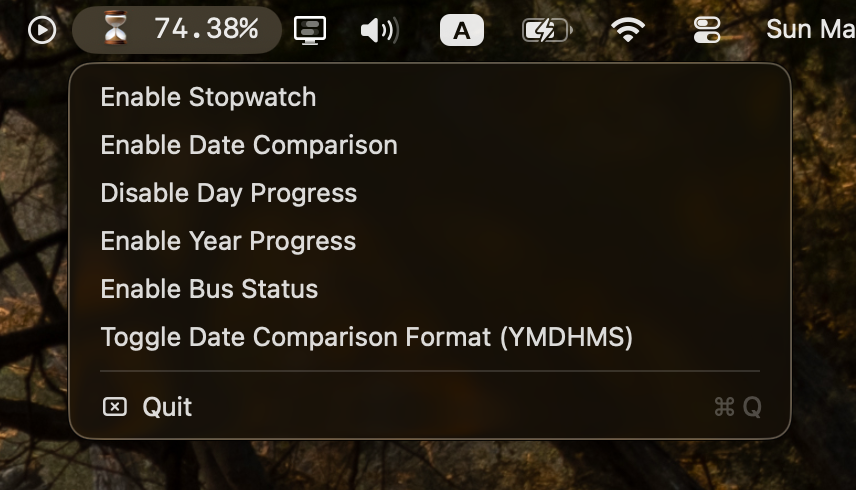

# ⏱️ Stopwatch

A macOS menu bar app built with Swift and AppKit.



## Features

- **Stopwatch** — timer displayed as `MM:SS` or `HH:MM:SS`, auto-stops after 24h
- **Date Comparison** — countdown to a target date in D, YMD, or YMDHMS format
- **Day Progress** — percentage of waking hours (6am–10pm) elapsed
- **Year Progress** — percentage of the current year elapsed
- **Bus Status** — live arrival times from the OASA telematics API

State is persisted to `~/.stopwatch_state.json`.

## Build

Open `Stopwatch.xcodeproj` in Xcode and run, or:

```
xcodebuild -scheme Stopwatch -configuration Release build
```

The built app bundle will be in `~/Library/Developer/Xcode/DerivedData/Stopwatch-*/Build/Products/Release/Stopwatch.app`.
